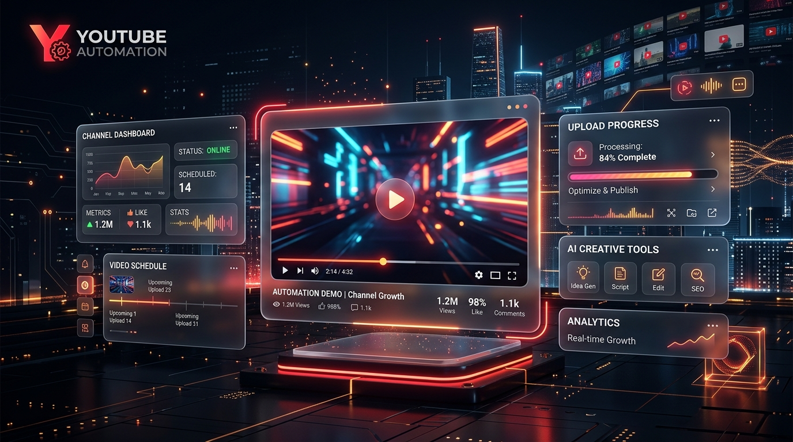
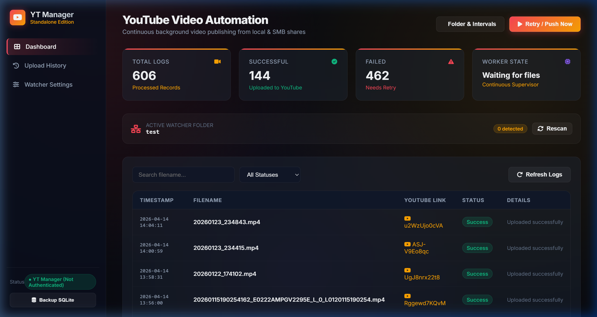
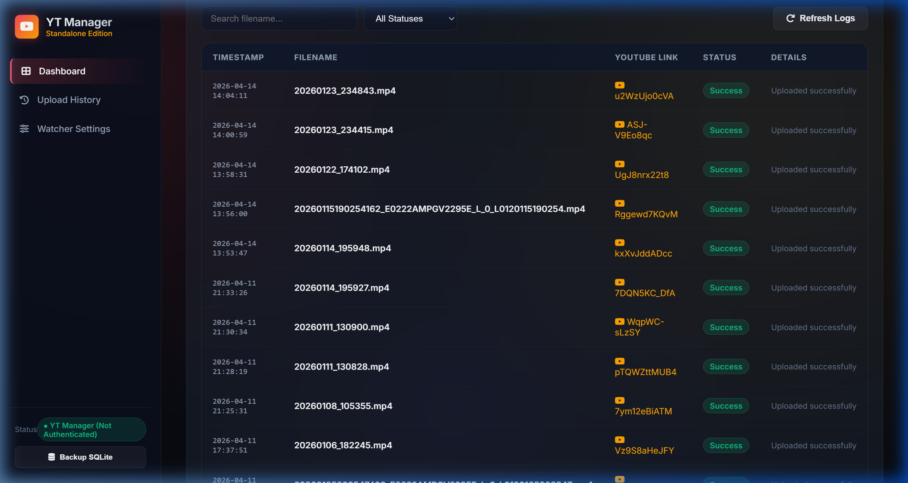
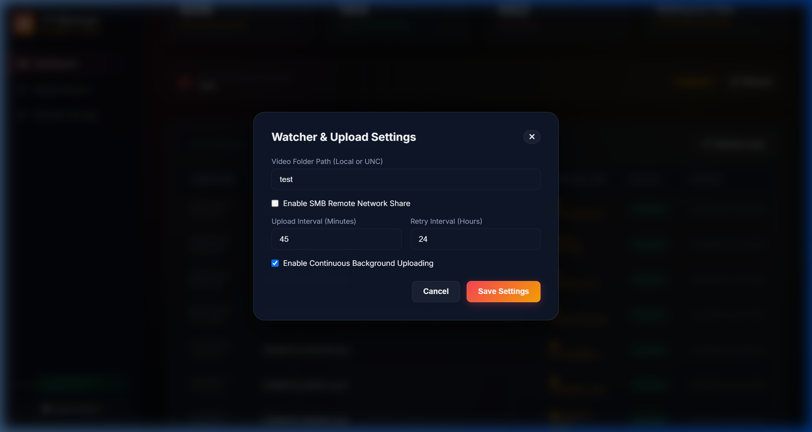
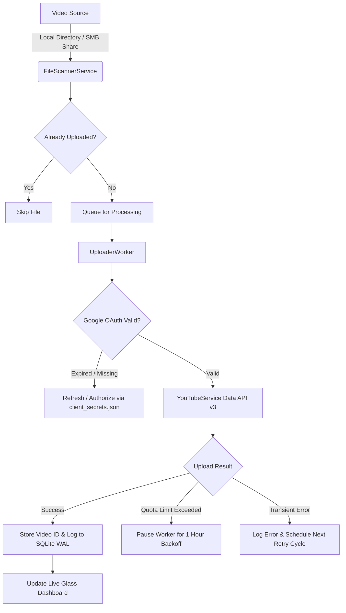

<div align="center">



# 🎬 YouTube Video Automation

### *Autonomous Background Video Publishing, SMB Network Share Watcher & Glassmorphic Dashboard*

[](https://python.org)
[](https://flask.palletsprojects.com/)
[](https://sqlite.org)
[](https://developers.google.com/youtube/v3)
[](https://github.com/jborean93/smbprotocol)
[](LICENSE)

<br/>

[](https://github.com/vijairathina/YouTube-Video-Automation/stargazers)
[](https://github.com/vijairathina/YouTube-Video-Automation/network/members)
[](https://github.com/vijairathina/YouTube-Video-Automation/issues)
[](https://github.com/vijairathina/YouTube-Video-Automation/pulls)

<br/>

**YouTube Video Automation** is a production-ready, autonomous video publishing engine. It continuously monitors local folders and remote Windows/SMB shares, queues video files (`.mp4`, `.mov`, `.mkv`, `.avi`), handles Google OAuth2 authentication, uploads to YouTube with intelligent quota backoff, and provides a real-time **dark glassmorphic control center**.

[Key Features](#-key-features) • [Screenshots](#-screenshots--walkthrough) • [Quick Start](#-quick-start) • [OAuth Setup](#-google-oauth2-setup-step-by-step) • [Architecture](#-architecture--upload-pipeline) • [Configuration](#-configuration-reference) • [API Docs](#-rest-api-endpoints) • [Contributing](#-contributing)

</div>

---

## 🌟 Key Features

- 💎 **Glass UI/UX Control Center**:
  - Live statistics: **Total Processed Logs**, **Successful Uploads**, **Failed Attempts**, and **Worker Status**.
  - Pending file inspection queue with real-time file detection and upload readiness.
  - Interactive upload history with searchable titles, direct YouTube video links (`https://youtu.be/<id>`), and error logs.
- 📁 **Automated Directory & SMB Network Watcher**:
  - Monitors local directories or remote Windows/Samba SMB shares (`\\server\share`).
  - Scans and detects common video extensions: `.mp4`, `.mov`, `.mkv`, `.avi`.
  - Temporary staging and streaming cache for network files to guarantee upload integrity.
- ⚡ **Zero-Restart Live Configuration**:
  - Change monitored directories, upload intervals (minutes), and retry delays (hours) on the fly directly from the UI without restarting the server.
- 🛑 **Intelligent Quota & Error Handling**:
  - Detects YouTube API daily quota limits (`uploadLimitExceeded`, HTTP 403).
  - Enters graceful standby (1-hour backoff) and automatically resumes once the quota window resets.
- 🔄 **One-Click Manual Retry & Push**:
  - Trigger immediate directory scans and retry failed uploads directly from the top bar.
- 🛡️ **Autonomous SQLite Reliability**:
  - Write-Ahead Logging (`PRAGMA journal_mode=WAL`) enabled for concurrent reads and writes.
  - Built-in one-click backup engine archiving snapshots to `backups/`.
  - Duplicate prevention: Every file is logged and verified against historical records.
- 🔒 **Zero Hardcoded Secrets**:
  - Fully decoupled credentials with environment variables, `.env.example`, and `client_secrets.json.example`.

---

## 📸 Screenshots & Walkthrough

### 1. Publishing Dashboard & Status Monitor
> Real-time status cards, active folder watcher indicator, pending uploads queue, and one-click database backup.

<div align="center">
  
</div>

---

### 2. Upload History Explorer & Video Links
> Full searchable history with timestamp tracking, status badges, direct YouTube video links, and detailed error messages for failed attempts.

<div align="center">
  
</div>

---

### 3. Watcher & Interval Settings Modal
> Configure target directories, toggle SMB remote network shares, adjust upload and retry intervals, and control background worker loops live.

<div align="center">
  
</div>

---

## ⚡ Architecture & Upload Pipeline



---

## 🚀 Quick Start

### Prerequisites
- **Python 3.10** or higher
- **Git**
- A **Google Cloud Project** with the **YouTube Data API v3** enabled

### 1. Clone the Repository

```bash
git clone https://github.com/vijairathina/YouTube-Video-Automation.git
cd YouTube-Video-Automation
```

### 2. Set Up Virtual Environment

```bash
# Create virtual environment
python -m venv venv

# Windows PowerShell:
.\venv\Scripts\Activate.ps1

# Linux / macOS:
source venv/bin/activate
```

### 3. Install Dependencies

```bash
pip install -r requirements.txt
```

### 4. Configure Environment & Credentials

```bash
# Copy example configuration
cp .env.example .env

# Copy example client secrets
cp client_secrets.json.example client_secrets.json
```

Edit `client_secrets.json` with your OAuth credentials (see [OAuth Setup Guide](#-google-oauth2-setup-step-by-step)).

### 5. Initialize Database & Launch

```bash
# Initialize SQLite tables (WAL mode)
python migrations/init_db.py

# Start the application
python run.py
```

Open your browser to: **[http://localhost:5002](http://localhost:5002)**

---

## 🔑 Google OAuth2 Setup (Step-by-Step)

To enable automatic uploads to your YouTube channel, set up an OAuth 2.0 Client ID in the Google Cloud Console:

1. **Create or Select a Google Cloud Project**:
   - Navigate to [Google Cloud Console](https://console.cloud.google.com/).
   - Create a new project (e.g., `YouTube-Automation`).
2. **Enable YouTube Data API v3**:
   - Go to **APIs & Services > Library**.
   - Search for **YouTube Data API v3** and click **Enable**.
3. **Configure OAuth Consent Screen**:
   - Go to **APIs & Services > OAuth consent screen**.
   - Select **External** (or **Internal** for Google Workspace).
   - Enter your App name and support email.
   - Under **Scopes**, add: `https://www.googleapis.com/auth/youtube.upload`.
   - Add your Google account under **Test Users**.
4. **Create OAuth Client ID**:
   - Go to **APIs & Services > Credentials > Create Credentials > OAuth client ID**.
   - Choose **Desktop App** as the Application type.
   - Click **Create**, then click **Download JSON**.
5. **Place Credentials**:
   - Rename the downloaded file to `client_secrets.json` and place it in the root folder of this repository.
   - On the first run, the uploader will open an authorization link in your browser to generate `data/token.json`. Once authorized, tokens refresh automatically.

> [!IMPORTANT]
> Never commit `client_secrets.json` or `token.json` to any public repository. They are already listed in `.gitignore`.

---

## 📁 Local Directory & SMB Network Share Setup

### Local Folder Mode
By default, the watcher monitors a local directory on the server.
1. Open the **Watcher Settings** modal (`⚙️ Folder & Intervals`).
2. Enter the absolute path to your folder (e.g., `D:\Videos\ReadyToUpload` or `/mnt/videos`).
3. Click **Save Settings**.

### SMB / Network Share Mode (NAS / Windows Shares)
To monitor files stored on a remote server or NAS over SMB:
1. Open **Watcher Settings**.
2. Check **Enable SMB Remote Network Share**.
3. Provide:
   - **SMB Share Name**: e.g., `\\192.168.1.50\media\youtube` or `StorageServer`
   - **Username**: Network account username
   - **Password**: Network account password
4. The background worker uses `smbprotocol` to authenticate and stage video chunks securely for upload.

---

## ⚙️ Configuration Reference

### Environment Variables (`.env`)

| Variable | Default | Description |
|:---|:---|:---|
| `PORT` | `5002` | HTTP port for the web dashboard and REST API |
| `HOST` | `0.0.0.0` | Bind address (`0.0.0.0` for LAN access, `127.0.0.1` for localhost only) |
| `DEBUG` | `false` | Enable Flask debug mode (`true`/`false`) |
| `SECRET_KEY` | `yt-manager-secret-...` | Session and CSRF encryption key |
| `DATABASE_PATH` | `data/yt_manager.db` | Path to the SQLite database |
| `CLIENT_SECRETS_FILE` | `client_secrets.json` | Google Cloud OAuth2 client credentials |
| `TOKEN_FILE` | `data/token.json` | Stored OAuth refresh tokens |

---

## 📊 REST API Endpoints

The backend provides a comprehensive RESTful API:

| Method | Endpoint | Description |
|:---|:---|:---|
| `GET` | `/api/health` | Service health status, database state, and YouTube auth status |
| `GET` | `/api/dashboard/stats` | Aggregated counters, worker state, active folder, and channel info |
| `GET` | `/api/uploads` | Paginated upload records with query filters (`page`, `limit`, `search`, `status`) |
| `GET` | `/api/files/pending` | Lists video files in the monitored directory and their upload readiness |
| `GET` | `/api/uploader/settings` | Returns active folder path, SMB configuration, and interval settings |
| `POST` | `/api/uploader/settings` | Updates watcher directory, SMB credentials, and upload intervals |
| `POST` | `/api/uploader/retry` | Triggers an immediate directory scan and upload attempt |
| `POST` | `/api/database/backup` | Creates a timestamped hot backup snapshot of the SQLite database in `backups/` |

---

## 🏗️ Project Structure

```text
YouTube-Video-Automation/
├── backend/
│   ├── app.py                      # Flask REST API & static web server
│   ├── config.py                   # Centralized configuration & environment loader
│   ├── database.py                 # SQLite WAL connection & backup manager
│   ├── models.py                   # SQLAlchemy ORM models (UploadLog, UploaderConfig, etc.)
│   ├── worker.py                   # Background supervisor & autonomous upload loop
│   └── services/
│       ├── smb_service.py          # Local folder & SMB share scanner
│       └── youtube_service.py      # YouTube Data API v3 upload & quota handler
├── frontend/
│   ├── index.html                  # Responsive dark glassmorphic dashboard
│   ├── css/
│   │   ├── glass.css               # Design tokens, blur filters & responsive layout
│   │   └── yt.css                  # YouTube themed badges, buttons & status indicators
│   └── js/
│       └── app.js                  # Frontend controller, REST client & state manager
├── docs/
│   ├── images/
│   │   └── banner.jpg              # High-resolution glassmorphic hero banner
│   ├── screenshots/
│   │   ├── dashboard.png           # Publishing overview & stats screenshot
│   │   ├── history.png             # Upload history table screenshot
│   │   └── settings.png            # Watcher & SMB configuration screenshot
│   ├── API.md                      # Detailed API specification
│   ├── ARCHITECTURE.md             # System design & component breakdown
│   ├── DATABASE.md                 # SQLite schema & indexing strategy
│   ├── MIGRATION.md                # Data migration documentation
│   └── SETUP.md                    # Production deployment & service setup
├── data/
│   └── .gitkeep                    # Retains data folder in git (DBs & tokens ignored)
├── migrations/
│   └── init_db.py                  # Schema generation & table initialization
├── scripts/
│   └── migrate_from_vtes.py        # Migration script for historical logs
├── tests/
│   └── test_yt.py                  # Test suite for uploader and services
├── .env.example                    # Template environment variables
├── .gitignore                      # Security rules (strictly ignores secrets & databases)
├── client_secrets.json.example     # Template Google OAuth2 credentials
├── LICENSE                         # MIT License
├── requirements.txt                # Python dependencies
└── run.py                          # Application entry point
```

---

## 🛡️ Production Deployment (Systemd & Windows Service)

### Linux (Systemd Service)
Create `/etc/systemd/system/youtube-automation.service`:

```ini
[Unit]
Description=YouTube Video Automation Service
After=network.target

[Service]
User=www-data
WorkingDirectory=/opt/YouTube-Video-Automation
ExecStart=/opt/YouTube-Video-Automation/venv/bin/python run.py
Restart=always
RestartSec=10
Environment="PYTHONUNBUFFERED=1"

[Install]
WantedBy=multi-user.target
```

Enable and start:
```bash
sudo systemctl daemon-reload
sudo systemctl enable --now youtube-automation
```

### Windows (NSSM - Non-Sucking Service Manager)
```cmd
nssm install YouTubeAutomation "D:\YouTube-Video-Automation\venv\Scripts\python.exe" "run.py"
nssm set YouTubeAutomation AppDirectory "D:\YouTube-Video-Automation"
nssm start YouTubeAutomation
```

---

## 🤝 Contributing

Contributions, bug reports, and feature requests are welcome!

1. **Fork the repository**
2. **Create your feature branch**: `git checkout -b feature/AmazingFeature`
3. **Commit your changes**: `git commit -m 'Add some AmazingFeature'`
4. **Push to the branch**: `git push origin feature/AmazingFeature`
5. **Open a Pull Request**

---

## ⭐ Show Your Support

If this project saves you time or helps automate your video workflow, please consider giving it a **Star** on [GitHub](https://github.com/vijairathina/YouTube-Video-Automation)!

---

## 📄 License

Distributed under the **MIT License**. See [`LICENSE`](LICENSE) for more information.

<div align="center">
  <sub>Built with ❤️ by <a href="https://github.com/vijairathina">Vijairathina</a></sub>
</div>
